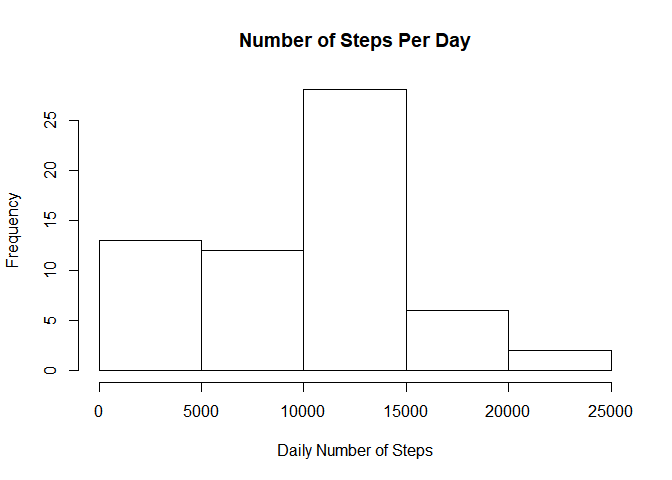
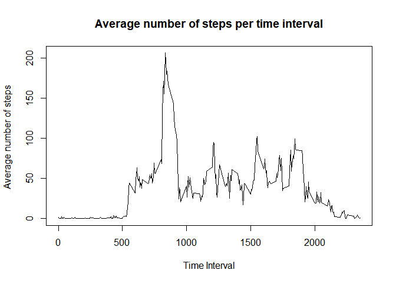
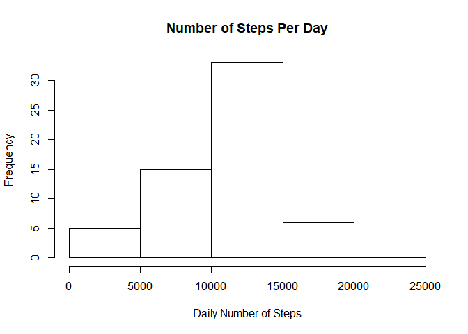
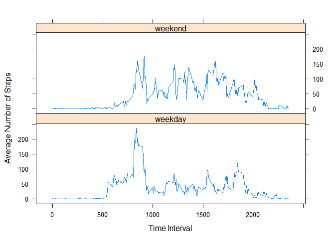

## Loading and preprocessing the data

The data for this assignment is available at this [link](https://github.com/cvscastejon/RepData_PeerAssessment1): 

### Reading the data

The link downloads a zip folder called "activity.zip". We unzip the folder and use read.csv, since the data is in a csv file and assign it to a data frame called `activity`. Then we get the class of all columns, to determine if any transformation is necessary.


```r
unzip("activity.zip")
activity <- read.csv("activity.csv")
lapply(activity, class)
```

```
$steps
[1] "integer"

$date
[1] "factor"

$interval
[1] "integer"
```

### Processing the Data
The second step is to do some processing. That includes turning the second column (date) into a date format.
For that, we use the library lubridate to make things simple.


```r
library(lubridate)
activity$date <- ymd(activity$date)
lapply(activity, class)
```

```
$steps
[1] "integer"

$date
[1] "Date"

$interval
[1] "integer"
```


## What is mean total number of steps taken per day?

In this segment, we want to make a histogram of the total number of steps, taken each day. 

### Histogram of Total Number of Steps
First we need to create a new data set that contatins this information. For that, we use the library `dyplr` to make things simpler.
Then, we simply group the data by date, making a sum of the number of steps and ploting a histogram from the bae plot system.


```r
library(dplyr)
totalSteps <- activity %>% group_by(date) %>% summarize(total_steps = sum(steps, na.rm = TRUE)) 
hist(totalSteps$total_steps, xlab = "Daily Number of Steps", main = "Number of Steps Per Day")
```

<!-- -->

Finally, we calculate the mean and the median of the total number os steps taken each day.

### Median Calculation:


```r
median(totalSteps$total_steps)
```

```
[1] 10395
```

### Mean Calculation:


```r
mean(totalSteps$total_steps)
```

```
[1] 9354.23
```


## What is the average daily activity pattern?

In this segment we calculate and make a time series plot of the 5-minute interval and average number of steps taken across all days.

### Average Number of Steps 

Just like we did in the last segment, first we make a new data frame containing the time intervals and the average of the number of steps per interval. We do that using the same `dplyr` library.


```r
averageDaily <- activity %>% group_by(interval) %>% summarize(average_steps = mean(steps, na.rm = TRUE)) 
plot(averageDaily$interval, averageDaily$average_steps, type = "l", xlab = "Time Interval", ylab = "Average number of steps ", main = "Average number of steps per time interval")
```

<!-- -->

### Time interval with maximum average

To get the interval with the maximum average value of number of steps, we use the `which.max` function.


```r
with(averageDaily, interval[which.max(average_steps)])
```

```
[1] 835
```


## Imputing missing values

The dataset contains intervals and even entire days with missing values. It is important to know if they may be causing some bias into the calculations or summaries.

To do that, first we calculate the total number of missing values:


```r
sum(is.na(activity$steps))
```

```
[1] 2304
```

### NA filling strategy: weekday, time interval average
To fill in the missing values, the strategy we will use will be to use the average for that interval in that particular week day.
So, we create a new data set filling the missing values from the activity data set with this information. 

First step, we create a dataframe with the average value by interval and weekday.


```r
avgIntWday <- activity %>% mutate(wday = wday(date, label = TRUE, abbr = TRUE)) %>% group_by(wday, interval)  %>% summarise(avg_step = mean(steps, na.rm = TRUE))
```


### Filling the missing values

With the data set with the averages calculated, we create a new data frame from activity with the missing values filled. We do that using a `for` loop to go in every missing value of the steps column in the data frame we just created. It then, checks the date and the interval of that missing values, and retrieves the average from that missing value from the `avgIntWday` data frame just created.


```r
filledActivity <- activity

for(i in 1:length(filledActivity$steps)){
  if(is.na(filledActivity$steps[i])){
    wdayNA <- as.character(wday(filledActivity$date[i], label = TRUE, abbr = TRUE))
    interNA <- filledActivity$interval[i]
    filledActivity$steps[i] <- as.numeric(avgIntWday[as.character(avgIntWday$wday) == wdayNA  & avgIntWday$interval == interNA,"avg_step"])
  }
}
```


### Histogram of data frame without missing values
Now we need to compare this new data frame with the original one using the histogram and new values for mean and median


```r
totalStepsFilled <- filledActivity %>% group_by(date) %>% summarize(total_steps = sum(steps, na.rm = TRUE)) 
hist(totalStepsFilled$total_steps, xlab = "Daily Number of Steps", main = "Number of Steps Per Day")
```

<!-- -->

Finally we calculate the new medians and means for the data with the missing values filled

### Median Calculation:


```r
median(totalStepsFilled$total_steps)
```

```
[1] 11015
```

### Mean Calculation:


```r
mean(totalStepsFilled$total_steps)
```

```
[1] 10821.21
```

Below is a table comparing the values and the error of inputing missing values using the strategy we described earlier:


```r
library(xtable)

#Median averages
medianNA <- median(totalSteps$total_steps)
medianFilled <- median(totalStepsFilled$total_steps)

#Mean averages
meanNA <- mean(totalSteps$total_steps)
meanFilled <- mean(totalStepsFilled$total_steps)

#Precision calculation
precisionMedian <- 1 - abs(medianFilled-medianNA)/medianNA
precisionMean <- 1 - abs(meanFilled-meanNA)/meanNA

#table construction
compTable <- data.frame(Average = c("Median", "Mean"), 
                        withNAs = c(medianNA,meanNA),
                        FilledValues = c(medianFilled, meanFilled),
                        Precision = c(precisionMedian,precisionMean))
#table printing
compTable <- xtable(compTable)
print(compTable, type = "html")
```

<!-- html table generated in R 3.6.3 by xtable 1.8-4 package -->
<!-- Mon Apr 13 18:36:45 2020 -->
<table border=1>
<tr> <th>  </th> <th> Average </th> <th> withNAs </th> <th> FilledValues </th> <th> Precision </th>  </tr>
  <tr> <td align="right"> 1 </td> <td> Median </td> <td align="right"> 10395.00 </td> <td align="right"> 11015.00 </td> <td align="right"> 0.94 </td> </tr>
  <tr> <td align="right"> 2 </td> <td> Mean </td> <td align="right"> 9354.23 </td> <td align="right"> 10821.21 </td> <td align="right"> 0.84 </td> </tr>
   </table>

As we can see, the NA filling strategy chosen made a new data set that had a precision of 94% precision regarding the median and 84% regarding the mean.


## Are there differences in activity patterns between weekdays and weekends?

In this final section we will try to identify a pattern differentiating weekdays from weekends. To do that, first we create a factor variable indicating if a given date is weekday or weekend


```r
#new column on filled data frame
filledActivity <- filledActivity %>% mutate(daytype = wday(date))

#function to determine if it's weekday/weekend
isweekday <-function(weeknum){
  if((weeknum == 1)  || (weeknum == 7)){
    return("weekend")
  } 
  else{
    return("weekday")
  } 
}

#apply on all elements
filledActivity$daytype <- lapply(filledActivity$daytype, isweekday)

#transform into factor variable
filledActivity$daytype <- as.factor(unlist(filledActivity$daytype))
```

With this information in hand, the next step is to print a plot comparing the average number of steps taken for evey time interval for weekends and weekdays, across all weekends or weekdays.

### Panel Plot with average number of steps per interval per acros weekdays and weekends

For that, we use the lattice plot system

```r
filledTable <- filledActivity %>% group_by(interval,daytype) %>% summarise(avg_step = mean(steps))
library(lattice)
xyplot(avg_step~interval|daytype, type = "l", data = filledTable,layout=c(1,2), xlab = "Time Interval", ylab = "Average Number of Steps")
```

<!-- -->

